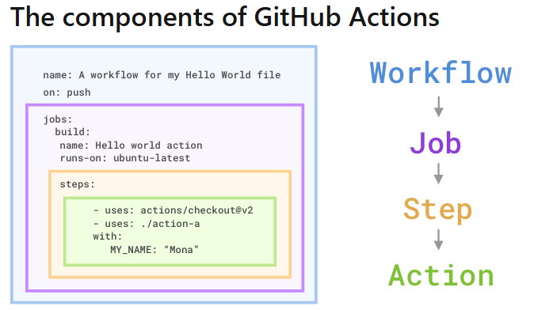
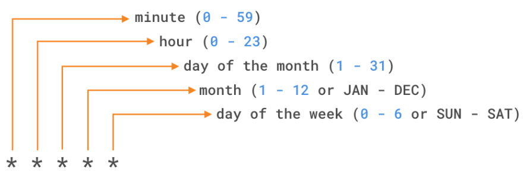

What is a GitHub Actions workflow?
LInk *https://docs.github.com/en/actions/writing-workflows/workflow-syntax-for-github-actions*

To create a workflow, you add actions to a .yml file in the .github/workflows directory in your GitHub repository.
main.yml will look like this
```yml
name: A workflow for my Hello World file
on: push
jobs:
  build:
    name: Hello world action
    runs-on: ubuntu-latest
    steps:
    - uses: actions/checkout@v1
    - uses: ./action-a
      with:
        MY_NAME: "Mona"
```

on: attribute. This is a trigger to specify when this workflow will run.
You can specify single events like on: push, an array of events like on: [push, pull_request], or an event-configuration map that schedules a workflow or restricts the execution of a workflow to specific files, tags, or branch changes.
```yml
on:
  # Trigger the workflow on push or pull request,
  # but only for the main branch
  push:
    branches:
      - main
  pull_request:
    branches:
      - main
  # Also trigger on page_build, as well as release created events
  page_build:
  release:
    types: # This configuration doesn't affect the page_build event above
      - created
```
Link for doc for events trigger
- *https://docs.github.com/en/actions/writing-workflows/choosing-when-your-workflow-runs/events-that-trigger-workflows*


GitHub-hosted versus self-hosted runners
there are two options from which to choose: GitHub-hosted runners or self-hosted runners
```yml
runs-on: {operating system-version} #then specifies that environment.
runs-on: ubuntu-latest
```
Limitation of github hosted runner
link for doc *https://docs.github.com/en/actions/administering-github-actions/usage-limits-billing-and-administration*


With self-hosted runners, you need to apply the self-hosted label, its operating system, and the system architecture
```yml
runs-on: [self-hosted, linux, ARM32]
```
 Self-hosted runners are a highly configurable way to run workflows in your own custom local environment. You can run self-hosted runners on-premises or in the cloud


Identify the components of GitHub Actions



Configure workflows to run for scheduled events

if you wanted to run a workflow every 15 minutes, the schedule event would look like the following:
```yml
on:
  schedule:
    - cron:  '*/15 * * * *'
```
And if you wanted to run a workflow every Sunday at 3:00am, the schedule event would look like this:
```yml
on:
  schedule:
    - cron:  '0 3 * * SUN'
```

Configure workflows to run for manual events
```
on:
  workflow_dispatch:
    inputs:
      logLevel:
        description: 'Log level'     
        required: true
        default: 'warning'
      tags:
        description: 'Test scenario tags'
```


In addition to workflow_dispatch, you can use the GitHub API to trigger a webhook event called repository_dispatch. This event allows you to trigger a workflow for activity that occurs outside of GitHub. It essentially serves as an HTTP request to your repository asking GitHub to trigger a workflow off an action or webhook. Using this manual event requires you to do two things: send a POST request to the GitHub endpoint /repos/{owner}/{repo}/dispatches with the webhook event names in the request body, and configure your workflow to use the repository_dispatch event.
```sh
curl \
  -X POST \
  -H "Accept: application/vnd.github.v3+json" \
  https://api.github.com/repos/octocat/hello-world/dispatches \
  -d '{"event_type":"event_type"}'
```

```yml
on:
  repository_dispatch:
    types: [opened, deleted]
```


Configure workflows to run for webhook events
You can trigger most webhook events from more than one activity for a webhook. If multiple activities exist for a webhook, you can specify an activity type to trigger the workflow. For example, you can run a workflow for the check_run event, but only for the rerequested or requested_action activity types.
```yml
on:
  check_run:
    types: [rerequested, requested_action]
```

Use conditional keywords
Although expressions are commonly used with the conditional if keyword in a workflow file to determine whether a step should run or not, you can use any supported context and expression to create a conditional. It's important to know that when using conditionals in your workflow, you need to use the specific syntax ${{ <expression> }}. This tells GitHub to evaluate an expression rather than treat it as a string.
```yml
name: CI
on: push
jobs:
  prod-check:
    if: github.ref == 'refs/heads/main'
    runs-on: ubuntu-latest
    steps:
      ...
```
NOTE:  in this example, the ${{ }} are missing from the syntax. With some expressions, as in the case of the if conditional, you can omit the expression syntax. GitHub automatically evaluates some of these common expressions, but you can always include them in case you forget which expressions GitHub automatically evaluates


Use an organization's templated workflow
If you have a workflow that multiple teams use within an organization, you don't need to re-create the same workflow for each repository. Instead, you can promote consistency across your organization by using a workflow template that's defined in the organization's .github repository. Any member within the organization can use an organization template workflow, and any repository within that organization has access to those template workflows.
You can find these workflows by navigating to the Actions tab of a repository within the organization, selecting New workflow, and then finding the organization's workflow template section titled "Workflows created by organization name". For example, the organization called Mona has a template workflow as shown here.


Use specific versions of an action
```yml
steps:    
  # Reference a specific commit
  - uses: actions/setup-node@c46424eee26de4078d34105d3de3cc4992202b1e
  # Reference the major version of a release
  - uses: actions/setup-node@v1
  # Reference a minor version of a release
  - uses: actions/setup-node@v1.2
  # Reference a branch
  - uses: actions/setup-node@main
```